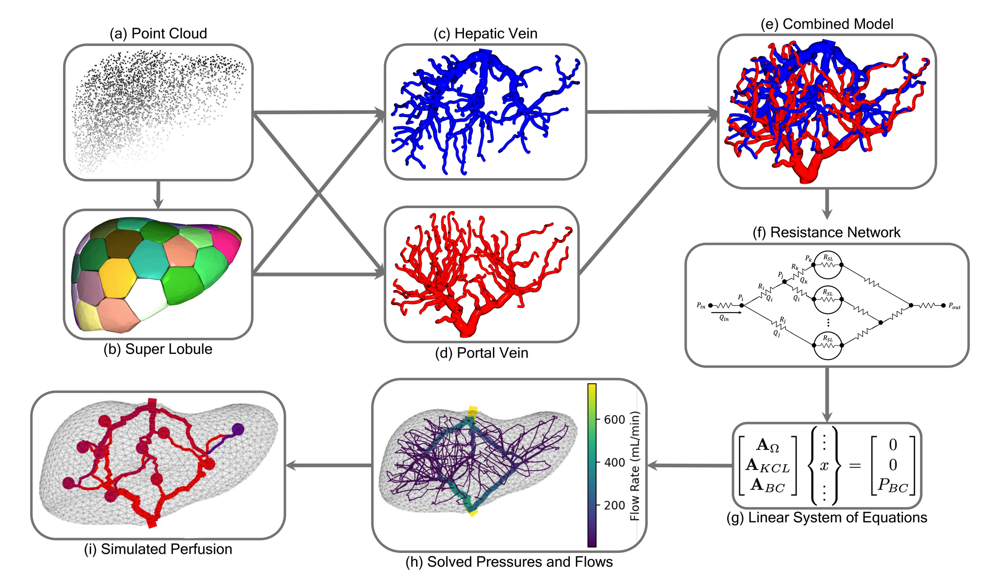

## Note: This readme file and documentation still needs some small updating (10/1/24), will be complete by EOD (10/7/24)
Additional results must be added, and some of the recently added code needs to be better commented. This readme file will also be improved prior to publication.

## Overview
This repository contains code to generate 3D vascular models of the human liver. Starting from an surface mesh (STL) of the liver, we utilize the space colonization algorithm to create a 3D model of the vasculature. We then simulate CPA loading/perfusion through the vasculature and investigate the effect of various pressure and flow rate boundary conditions.

# Code
Within the *src* folder there are many classes central to the model's data structure, namely colony.py, branch.py, superlobule.py, node.py, attractor.py and segment.py. Models can be created in the manner outlined in main.py, as well as in many of the study specific files: nSLConvergence.py, PQGrid.py, tConvergence.py, and consistency.py. Their respective analysis files for generating plots and results are contained within the analysis folder. Code to simulate the filling of models is contained within the colony.py class, and code used to generate the custom 3 visualizations is contained within visualizer.py.

## Data Availability
Where available, results are made available in the results folder, but many of the files are too large to be hosted on Github. We provide all code necessary to generate these results, but files can also be made available upon request to <danielem@andrew.cmu.edu> or <lkara@cmu.edu>.

